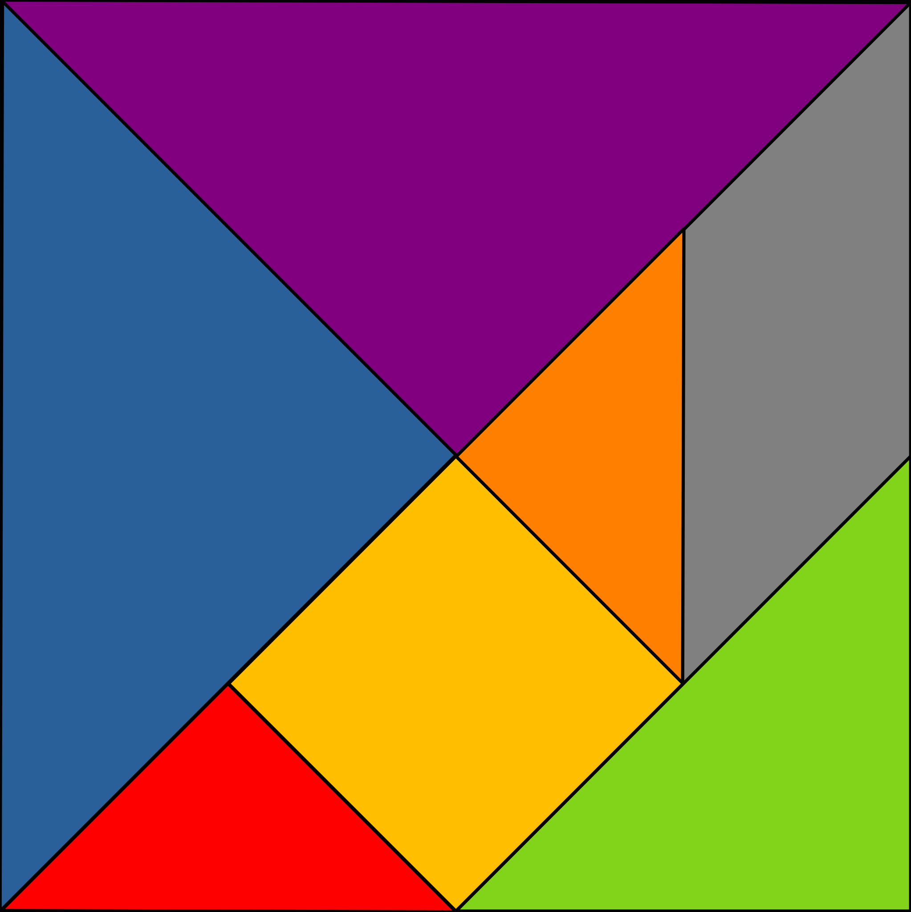
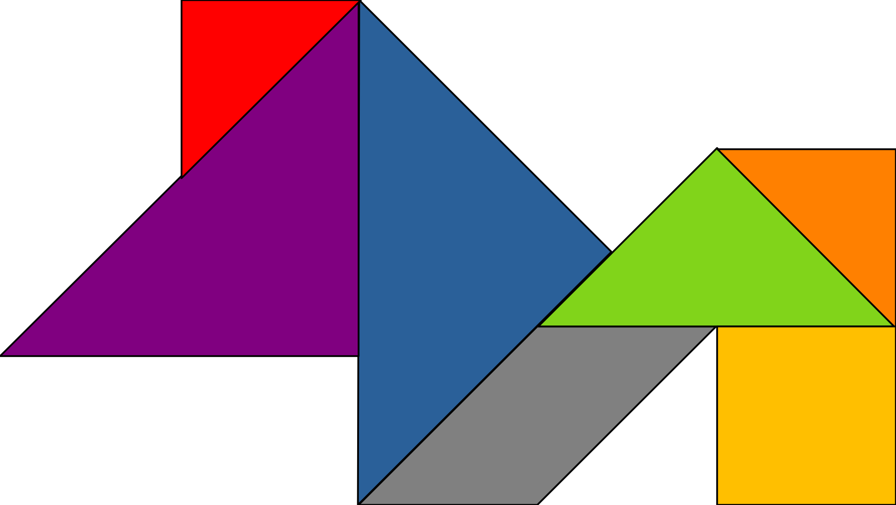

# Tangram Puzzle
for Android

An implementation of the
[Tangram](https://en.wikipedia.org/wiki/Tangram) — a tiling puzzle
consisting of seven polygons (five triangles in three sizes, a square,
and a parallelogram) that can be put together to form shapes.
Includes a number of puzzles that the player can try to solve, or the
player can sketch out their own shapes.

_Planned for release on [F-Droid](https://f-droid.org/)…_

This application is free to use and modify according to the terms of
the [Gnu General Public License (GPL) Version 3](doc/gpl-3.0.txt).

Instructions for building the application from source on the to-do list…

## What Is a Tangram?

The tangram (七巧板) is an old type of puzzle thought to originate around
the turn of the 19th century in China; its inventor is only known by the
pen name Yang-cho-chu-shih from the lost book _Ch'i chi'iao t'u_.  It is
a dissection puzzle consisting of seven polygons called _tans_ which are
put together to form shapes.  The tans are derived by cutting a square
along a number of 45° angles and one horizontal line, as shown below:

This forms two large triangles each a quarter of the original square’s
size, one medium triangle half the size of a large triangle, two small
triangles each half the size of the medium triangle, and a square and
parallelogram both having the same area as the medium triangle.  All
seven tans must be used to form a tangram shape, and must be connected
without overlapping.

This is just one simple example; people have come up with thousands of
unique tangrams over the centuries.

## How Do I Play?

This app has two modes of play: you can either try to solve one of the
puzzles that comes with the app, or you can sketch out your own tangram
in free-form mode.  In either case when you start a game the app will
show the available tans in a tray along the bottom or side of the screen.
Drag a tan from the tray into the play area to place it.  To turn the
tan, use two fingers.  The parallelogram piece is special in that it
doesn’t have reflective symmetry (i.e. it’s a different shape when
flipped over); when this tan is selected, a “flip” button appears you
can tap to flip it.

The play area is a little larger than the space needed to make a tangram
shape.  If you need to work outside the visible area, you can drag the
table beneath the tans or you can “pinch” the screen to zoom out.
A reverse pinch will zoom back in.  Dragging a tan outside of the play
area will return it to the tray in case you need access to the table
underneath.

### Puzzles

From the main menu, clicking on “Puzzle Library” will show a list of
all the puzzles the app knows.  The app comes with over 100 puzzles.
Clicking on any of these will start the game with that puzzle as your
goal.  Alternatively you can click “Random Puzzle” from the main menu
to have the app choose a puzzle for you.

When you solve the puzzle, the app will let you know.  Some puzzles may
have more than one solution; it doesn’t matter which arrangement you
make to get there, as long as the silhouettes are the same.  The app
helps you with placement by making sure all tans snap to a rotation
that is a multiple of 15° (the vast majority of puzzles are oriented
in multiples of 45°) and that edges and vertices snap together when
they are close enough.

#### Getting Help

Some of the puzzles may be difficult.  If you find you’re stuck or
you have players who need extra assistance, you can configure the
app to show how the puzzles are formed.  Press the “Exit” button from
the play screen (don’t worry – the app will remember where you left it)
and then go to “Preferences” to change the piece coloring and/or
hint level.  “Piece coloring” just affects the tans that you place,
as well as many of the app icons.  When the hint level is “Solution”,
all tans in the goal view will be shown in unique colors for easy
identification.  Then return to the main menu and click “Resume Puzzle
In Progress” to pick up the puzzle where you left off.  This setting
will also affect how puzzles in the library are shown, so be sure to
switch it back to “None” if you don’t want _all_ the answers!

### Free-form

Choosing “Free-form” from the main menu will let you create your own
tangrams.

#### Saving Your Tangrams

The app can save tangrams that you make, but before it can do so you
must choose a folder on your Android device that you want to store
them in.  From the main menu go to “Preferences” and then click the
“Folder for User Puzzles” button, then select or create a folder to
use and tell Android to allow Tangram to read and write files in this
folder.

Once that is set up, whenever you make a valid tangram in free-form mode
a “Save” button will appear.  Click this button and then fill in the
dialog with a category, name, and ID for your tangram.  The category
will be used to make the name of the tangram file, e.g.
“`puzzles-`_category\_name_`.json`”.  The name can be anything you
want and will be shown with your tangram in the Puzzle Library.  The
ID should be unique and may be used to load alternate names for the
puzzle from translation files.

## Acknowledgements

Parts of this program were generated or medified by Claude Code (Opus
4.8) which has been indispensible in making sure the app follows
modern Android development guidelines, figuring out the maths involved
in rendering interactive tangram pieces, and troubleshooting bugs.

The "geometric" and "objects" puzzles were downloaded from:
https://www.myhomeschoolmath.com/Worksheets/Tangram-Objects.pdf

The "animals" puzzles were downloaded from:
https://www.myhomeschoolmath.com/Worksheets/Tangram-Animals.pdf

The "people" puzzles were donwloaded from:
https://www.myhomeschoolmath.com/Worksheets/Tangram-People.pdf

The "Christmas" puzzles were downloaded from:
https://www.myhomeschoolmath.com/Worksheets/Tangram-Christmas.pdf

The "numbers" puzzles were downloaded from:
https://www.myhomeschoolmath.com/Worksheets/Tangram-Numbers.pdf

The "alphabet" puzzles were mostly downloaded from:
https://www.shutterstock.com/image-vector/alphabet-font-abc-tangram-collection-vector-2270175397
with a few substitutions from other sources that had better-looking
letters.

## [Keep Android Open](https://keepandroidopen.org/)

In August 2025, Google announced that as of September 2026, it will no
longer be possible to develop apps for the Android platform without
first registering centrally with Google.  This would involve paying
Google an annual fee and given them my private signing key.  Since I
am sharing this app in the hope that it will be useful and not for any
profit I find it unreasonable to pay Google just to make this app
available; and one of the most basic tenets of computer security as
that you _never_ share passwords or private keys with anyone else
because that would allow bad actors to impersonate you.
